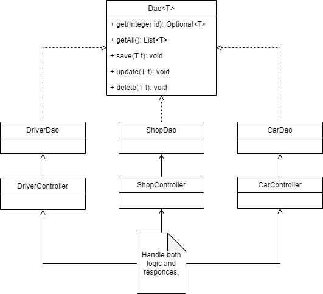

# Practical work #1

## Task 1: Setting up an application server

### Booting up
GlassFish is used as an application server. We boot it up using
the following command: 
`asadmin.bat start-domain`

### Setting up connection to a database

Do a manual setup of the connection to the database in 
the Administration console. First, create a JDBC Connection Pool:

Second, create a JDBC Resource:

## Task 2: Installing and launching database

Docker image of the PostgreSQL database is used. Boot up command:
`docker-compose up --build`

## Task 3: Making the model

The model is very simple and consists only
of three entities:
- Driver - describes a driver.
- Shop - describes a shop selling cars.
- Car - describes a model of the car as well as
which shop and driver it belongs to.

Database logical structure:

## Task 4: Data layer

For each table a Java Bean class was created. With our good friend's 
advice we used Lombok library to avoid boilerplate code
and accelerate development.

## Task 5 - 6: Business and view layer

Data Access Object pattern was used to provide access to the database. 
Since the application does not have any fancy logic in it, only 
data manipulation stuff, business and view layers are merged to avoid 
redundant code. All  the necessary functionality is implemented in 
the corresponding servlet classes. Nevertheless, we understand that 
ideally one would have to create separate classes that contain the 
actual application logic and then "connect" them to the servlets
using interfaces.

## Task 7: Make everything work together

It was a hell of a challenge, but somehow we managed to do this.
