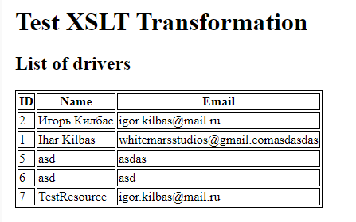
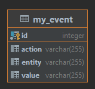
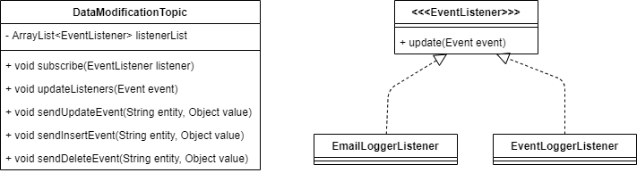
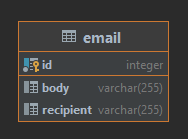

# Practical work #2: Spring

## Task 1: Model, Database, etc.

Similar to that of previous practical work.

## Task 2: Data layer

This time data layer is implemented using CRUD repositories allowing for less code to
be written.

## Task 3: Business layer

Business layer is implemented using Spring Services. 
Though there is not much business or logic... 

## Task 4: View layer

Nothing much has changed, now we use annotations from Spring.

# Practical work #3: RESTful web-service

## Task 1: SpringREST

We chose SpringREST as we expect it to be much more popular than JAX-RS. Apart from that, the 
application itself uses Spring here and there, why not continue using Spring for REST?

## Task2: Developing REST API

All the applications has already been developed with REST API in mind.

## Task 3: Implementing REST API

Same answer as in previous task. SpringREST by default allows for usage of both
XML and JSON.

## Task 4-6: XSL transformation

We have added a new method for `getAll` request which processes case, when
user supplies `accept` header with `application/xml` value. It uses a magical
converter that transforms XML into beautiful HTML.

# Practical work 4: JMS

## Task 1: New database table

We created the following table:

## Task 2-6: Implementing JMS

We implemented pattern Listener for this task.

The following classes were created:

DataModificationTopic represents a 'logging layer' of each service
meaning that it 'logs' every event related to the data modification (delete, add, update).
Instances of classes that implement `EventListener` interface can subscribe to DataModificationTopic
to listen for the corresponding event. Once an event occurs, DataModificationTopic notifies
all of its listeners by calling `update` method in each one and providing the corresponding
`Event` instance.
Speaking of listeners, two listeners were created: 
1. `EventLoggerListener` - logs every event into a database.
2. `EmailLoggerListener` - imitates sending a corresponding email when some event occurs.
In truth it simply writes everything into the database.

