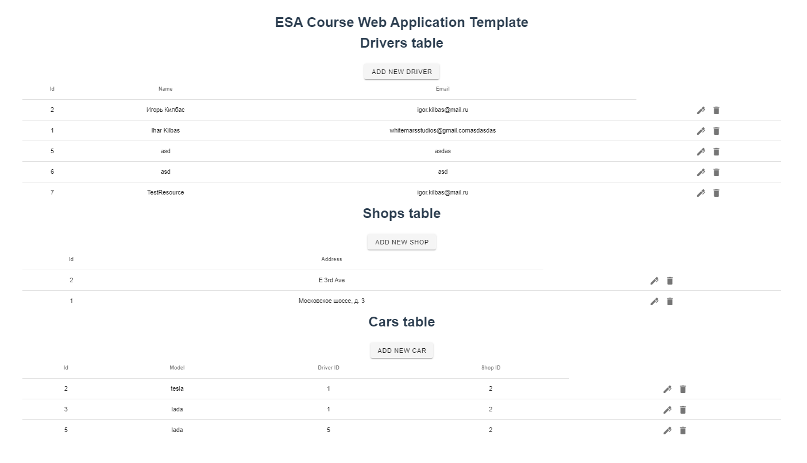

## Description

This repository contains completed assignments for Enterprise System Architecture course.
All the assignments were done by two students: Kilbas Igor (6132-010402D) and Yulia Bogdanova (6131-010402D).

## Repository structure

There are several folders:
- Lab1 - code for Practical Work #1 (JavaEE).
- Lab2 - code for Practical Works #2-4 (Spring).
- webtemplate-ee - web interface for Practical Work #1.
- webtemplate-spring - web interface for Practical Work #2-4.

Both web interfaces are using yarn. In order to launch one them, open terminal in the folder
of the corresponding web interface and enter the following command:
`yarn serve --port 8081`

`Postman` application can be used to test all the requests instead of launching web interface.

## How the application looks (for both JavaEE and Spring versions)

